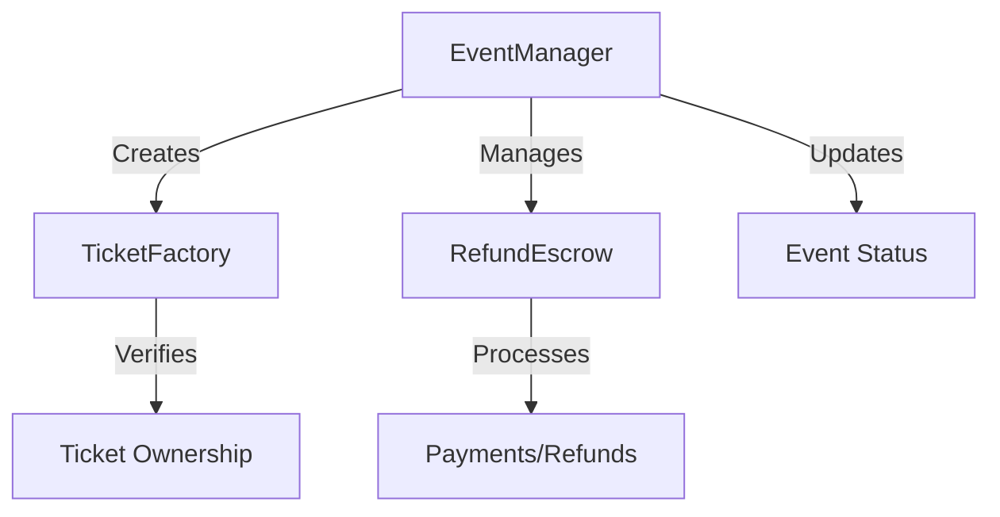

# Smart Contracts Documentation

## Overview
This document provides detailed documentation for the smart contracts and test files in the Blockchain Ticket App project.

## Core Contracts

### 1. TicketFactory.sol
**Purpose**: Handles the creation and management of individual tickets as NFTs (Non-Fungible Tokens).

**Key Components**:
- `Ticket` struct:
  ```solidity
  struct Ticket {
      uint256 eventId;    // References the associated event
      uint256 price;      // Ticket price
      bool used;          // Tracks if ticket has been used
      uint256 seatNumber; // Assigned seat number
  }
  ```

**Key Functions**:
- `createTicket(uint256 eventId, uint256 price, uint256 seatNumber)`: Creates new ticket NFT
- `useTicket(uint256 tokenId)`: Marks ticket as used at event entry

**Security Features**:
- Inherits from OpenZeppelin's ERC721
- Ownership checks for ticket usage
- One-time use enforcement

### 2. EventManager.sol
**Purpose**: Manages event creation, ticket sales, and event lifecycle.

**Key Components**:
- `Event` struct:
  ```solidity
  struct Event {
      string name;
      uint256 date;
      uint256 basePrice;
      address organizer;
      bool cancelled;
      uint256[] zoneCapacities;
      uint256[] zonePrices;
  }
  ```
- `Zone` struct:
  ```solidity
  struct Zone {
      uint256 capacity;
      uint256 price;
      uint256 availableSeats;
  }
  ```

**Key Functions**:
- `createEvent()`: Creates new event with zones and pricing
- `cancelEvent()`: Handles event cancellation
- `purchaseTicket()`: Processes ticket purchases
- `getEvent()` & `getZone()`: View functions for event/zone details

**Security Features**:
- ReentrancyGuard for purchase functions
- Pausable functionality for emergency stops
- Access control for organizers
- Platform fee handling (5%)

### 3. RefundEscrow.sol
**Purpose**: Manages payment processing and refund mechanics.

**Key Components**:
- `Payment` struct:
  ```solidity
  struct Payment {
      address payer;
      uint256 amount;
      PaymentStatus status;
      bool waitlistRefundEnabled;
  }
  ```
- `PaymentStatus` enum: `Pending`, `Released`, `Refunded`

**Key Functions**:
- `depositPayment()`: Handles initial payment processing
- `releasePayment()`: Releases funds to organizer
- `refundPayment()`: Processes refunds
- `enableWaitlistRefund()`: Enables waitlist-based refunds

**Security Features**:
- NonReentrant guards
- Pausable functionality
- Strict status checks
- Emergency fund recovery

## Interfaces

### 1. IEventManager.sol
**Purpose**: Defines the contract interface for EventManager.

**Key Definitions**:
- Event structures
- Function signatures
- Event emissions

### 2. IRefundEscrow.sol
**Purpose**: Defines the contract interface for RefundEscrow.

**Key Definitions**:
- Payment status enums
- Core function signatures
- Event definitions

## Test Files

### 1. TicketFactory.test.ts
**Purpose**: Tests ticket creation and management functionality.

**Test Cases**:
```typescript
- Should create a new ticket
- Should track ticket ownership
- Should prevent unauthorized ticket usage
- Should mark tickets as used correctly
```

### 2. EventManager.test.ts
**Purpose**: Tests event management and ticket sales.

**Test Cases**:
```typescript
describe("Event Creation"):
  - Should create new event with zones
  - Should validate zone pricing
  - Should track available seats

describe("Ticket Purchase"):
  - Should process ticket purchases
  - Should handle platform fees
  - Should prevent overselling
```

### 3. RefundEscrow.test.ts
**Purpose**: Tests payment and refund functionality.

**Test Cases**:
```typescript
describe("Payment Deposit"):
  - Should accept payments
  - Should track payment status

describe("Payment Release"):
  - Should distribute fees correctly
  - Should update payment status

describe("Refunds"):
  - Should process valid refunds
  - Should handle waitlist refunds
```

## Contract Interactions


## Security Considerations

1. **Access Control**:
   - Owner-only functions
   - Organizer-specific controls
   - Buyer verification

2. **Financial Safety**:
   - Escrow mechanics
   - Platform fee handling
   - Refund conditions

3. **State Management**:
   - Status tracking
   - Atomic operations
   - Event validation

4. **Emergency Controls**:
   - Circuit breakers (pause)
   - Emergency fund recovery
   - Status reversals

## Gas Optimization Techniques

1. **Storage Optimization**:
   - Struct packing
   - Minimal storage usage
   - Efficient data types

2. **Function Optimization**:
   - View/Pure function usage
   - Batch operations
   - Loop optimization

3. **Event Emission**:
   - Indexed parameters
   - Essential data only
   - Structured logs

## Deployment Considerations

1. **Network Selection**:
   - Permissioned network compatibility
   - Gas cost considerations
   - Network requirements

2. **Contract Dependencies**:
   - OpenZeppelin contracts
   - External libraries
   - Contract ordering

3. **Initialization**:
   - Constructor parameters
   - Initial state setup
   - Admin configuration

## Testing Strategy

1. **Unit Tests**:
   - Individual function testing
   - State validation
   - Error cases

2. **Integration Tests**:
   - Contract interaction testing
   - Complex scenarios
   - Edge cases

3. **Gas Testing**:
   - Function gas costs
   - Optimization verification
   - Transaction batching

4. **Security Testing**:
   - Access control
   - Reentrancy protection
   - Overflow/underflow